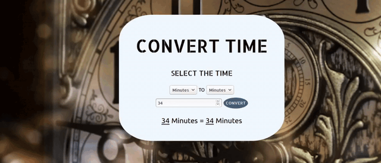

# CONVERT-TIME
## A simple code developed in javascript to convert days, hours, minutes or seconds each other :alarm_clock:

## HOW TO INIT THE APPLICATION

In the terminal, clone the project

~~~shell
git clone https://github.com/lucas-andrad/tictactoe.git
~~~

Before, enter in the folder

~~~shell
cd tictactoe
~~~

Finally, open the index.html file.

